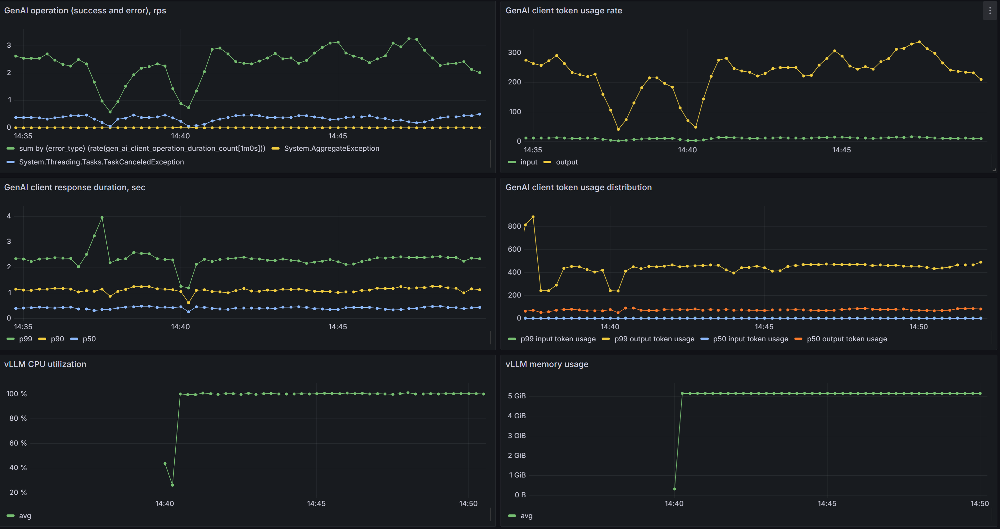

# Local vllm and client app sample

Prerequisites:

- Docker

How to run:

1. run with `docker-compose up`
2. open http://localhost:8084
3. add prompt and submit
4. You can check generated telemetry in Aspire dashboard (http://localhost:18888) included in docker-compose

API access:

1. run with `docker-compose up`
2. `curl -X POST http://localhost:8084/chat?prompt=tell%20me%20a%20joke` to get completion. It'd return full completion as json

   ```json
    {
      "createdAt": "2024-08-31T22:45:58+00:00",
      "finishReason": 0,
      "contentTokenLogProbabilities": [],
      "refusalTokenLogProbabilities": [],
      "role": 2,
      "content": [
        {
          "kind": {},
          "text": "The top 3 reasons to not buy a PS4\nWhy not? It's a budget console and it will run very well.\nI mean, I'm not saying you shouldn't buy it, but I rather just play it. I have a ps4 and I'm not planning on buying it.   The reason for buying it is that it's a great console with an excellent game library and I've never had any issues with it.   I wouldn't say it's just a budget console, but you could say that it's a decent console.\nI don't know why you're so against it, I'm sure it's going to be great. I'm just saying that it's a great console with one of the best games and a fantastic game library.   There's no need to buy a console for gaming purposes. It's a cheap laptop with a great games library.",
          "refusal": null,
          "imageUri": null,
          "imageBytes": null,
          "imageBytesMediaType": null,
          "imageDetail": null
        }
      ],
      "toolCalls": [],
      "functionCall": null,
      "refusal": null,
      "id": "cmpl-a9fd4f1697de4536a82ce39eba880b88",
      "model": "facebook/opt-125m",
      "systemFingerprint": null,
      "usage": {
        "outputTokens": 184,
        "inputTokens": 5,
        "totalTokens": 189
      }
    }
   ```
3. You can check generated telemetry in Aspire dashboard (http://localhost:18888) included in docker-compose

## Chat apps

There are two chat apps with very similar functionality, one in Python another in .NET.
Python one runs on port 8085, .NET on port 8084.

Python one has some issues with telemetry:
- no HTTP or GenAI client metrics (yet)
- some (probably fixable) problems with HTTP server metrics - the histogram boundaries are wrong.

## Run vLLM on CPU

To run, vLLM on CPU instead of GPU, you need to build the vLLM CPU docker image using the
following commands.

```
git clone https://github.com/vllm-project/vllm.git
cd vllm
docker build -f Dockerfile.cpu -t vllm-cpu-env --shm-size=4g .
```

Once you have the vLLM image, you can run the following to bring up the vLLM
container along with the client applications.

```
docker-compose -f docker-compose-vllm-cpu.yaml up
```

## Checking telemetry

1. **Aspire** Traces, metrics, and logs are exported to local Aspire dashboard available at http://localhost:18888. Best for logs and traces
2. **Prometheus** Metrics are additionally exported to Prometheus on http://localhost:9090. Nothing good to see there
3. **Grafana** shows nice UX for Prometheus metrics at http://localhost:3003. You'll need to import [GenAI client dashboard](./grafana/gen-ai-client-dashboard.json) to see
   

## Run on a Kind cluster

1. Install kubectl
```
curl -LO https://dl.k8s.io/release/v1.24.12/bin/linux/amd64/kubectl
chmod +x kubectl
mv kubectl /usr/bin/
```

2. Install helm
```
wget https://get.helm.sh/helm-v3.11.3-linux-amd64.tar.gz
tar -xvzf helm-v3.11.3-linux-amd64.tar.gz
mv linux-amd64/helm /usr/bin/
```

3. Install kind from a fork because GPU support is not available in the official one yet.
```
git clone -b gpu https://github.com/jacobtomlinson/kind
cd kind
make build
mv bin/kind /usr/bin/
```

4. Start a kind cluster with GPU using the following steps and install nvidia gpu operator.
```
kind create cluster --config kubernetes/kind-gpu.yaml

# Install nvidia operator
helm repo add nvidia https://nvidia.github.io/gpu-operator
helm repo update
helm install nvidia/gpu-operator \
  --wait --generate-name \
  --create-namespace -n gpu-operator \
  --set driver.enabled=false \
  --set mig.strategy=none \
  --version 23.3.1
```

5. Deploy vllm
```
kubectl apply -f vllm.yaml
```

6. Deploy prometheus.
```
# Install Prometheus CRDs
LATEST=$(curl -s https://api.github.com/repos/prometheus-operator/prometheus-operator/releases/latest | jq -cr .tag_name)
curl -sL https://github.com/prometheus-operator/prometheus-operator/releases/download/${LATEST}/bundle.yaml | kubectl create -f -

# Check if it is complete
kubectl wait --for=condition=Ready pods -l  app.kubernetes.io/name=prometheus-operator -n default

# Deploy prometheus
kubectl apply -f pod-monitor.yaml

# Query prometheus to make sure vllm metrics are available from inside a pod in the kind cluster
kubectl exec -it ${vllm-pod-name} -- bash
curl -g 'http://${PROMETHEUS_POD_IP}:9090/api/v1/series?' --data-urlencode 'match[]=vllm:num_requests_waiting' | jq
curl -g 'http://${PROMETHEUS_POD_IP}:9090/api/v1/series?' --data-urlencode 'match[]=vllm:gpu_cache_usage_perc' | jq

# Install prometheus adapter
kubectl apply -f prometheus-adapter.yaml
kubectl rollout restart deployment prometheus-adapter

# Verify that the custom metrics are queryable
kubectl get --raw /apis/custom.metrics.k8s.io/v1beta2
kubectl get --raw "/apis/custom.metrics.k8s.io/v1beta2/namespaces/default/pods/*/vllm_num_requests_running"
```

6. Setup vllm to autoscale
```
kubectl apply -f hpa.yaml
```

7. Generate load using benchmarking
```
git clone git@github.com:vllm-project/vllm.git
cd vllm/benchmarks
wget https://huggingface.co/datasets/anon8231489123/ShareGPT_Vicuna_unfiltered/resolve/main/ShareGPT_V3_unfiltered_cleaned_split.json

# Create vitrualenv before running the pip install commands below
pip install numpy aiohttp huggingface_hub transformers datasets Pillow
python3 benchmark_serving.py --model=tiiuae/falcon-7b --dataset-path=ShareGPT_V3_unfiltered_cleaned_split.json --dataset-name=sharegpt --tokenizer=tiiuae/falcon-7b --num-prompts=5000 --request-rate=50
```

8. Watch it autoscale
```
kubectl describe hpa
```